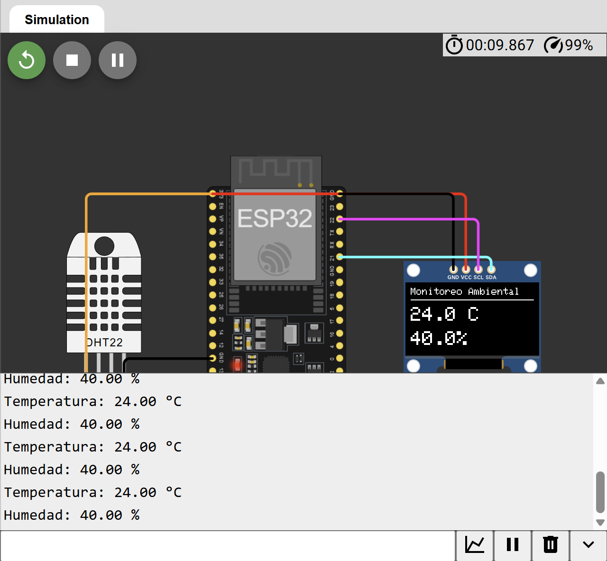

# Monitoreo Inteligente de Temperatura

## Descripción

Proyecto de monitoreo ambiental desarrollado con ESP32, sensor DHT22 y pantalla OLED SSD1306 para visualizar en tiempo real variables de temperatura y humedad.

El sistema adquiere datos del entorno mediante el sensor DHT22 y los presenta localmente en una pantalla OLED, permitiendo supervisar condiciones ambientales sin necesidad de equipos externos. Este tipo de solución es ampliamente utilizada en centros de datos, almacenes, laboratorios, invernaderos y sistemas HVAC.

---

## Objetivo

Implementar un sistema embebido capaz de medir y visualizar temperatura y humedad en tiempo real utilizando un ESP32, una pantalla OLED y un sensor DHT22.

---

## Componentes Utilizados

- ESP32 DevKit V1
- Sensor DHT22
- Pantalla OLED SSD1306 (128x64 I2C)
- Wokwi Simulator

---

## Funcionamiento

El ESP32 realiza lecturas periódicas del sensor DHT22 y muestra la información en una pantalla OLED SSD1306.

El sistema permite:

1. Capturar datos de temperatura.
2. Capturar datos de humedad relativa.
3. Visualizar la información en tiempo real.
4. Supervisar variables ambientales localmente.
5. Registrar lecturas mediante el monitor serial.

---

## Arquitectura

```text
┌─────────────┐
│   DHT22     │
│ Temperatura │
│  Humedad    │
└──────┬──────┘
       │
       ▼
┌─────────────┐
│    ESP32    │
└──────┬──────┘
       │ I2C
       ▼
┌─────────────┐
│ OLED SSD1306│
│ Visualización│
└─────────────┘
```

---

## Conexiones

### Sensor DHT22

| DHT22 | ESP32 |
|--------|--------|
| VCC | 3V3 |
| DATA | GPIO15 |
| GND | GND |

### Pantalla OLED SSD1306

| OLED | ESP32 |
|--------|--------|
| VCC | 3V3 |
| GND | GND |
| SDA | GPIO21 |
| SCL | GPIO22 |

---

## Diagrama



---

## Simulación en Wokwi

🔗 Simulación:

```text
https://wokwi.com/projects/467207249878760449
```

---

## Código

El código fuente se encuentra en:

```text
codigo/sketch.ino
```

---

## Visualización en Pantalla

Ejemplo de salida:

```text
Monitoreo Ambiental
-------------------

24.8 C

56.3%
```

---

## Monitor Serial

Ejemplo de salida:

```text
Temperatura: 24.8 °C
Humedad: 56.3 %
```

---

## Características

- Monitoreo de temperatura en tiempo real.
- Monitoreo de humedad en tiempo real.
- Visualización mediante pantalla OLED.
- Comunicación I2C.
- Lectura periódica de sensores.
- Interfaz local para supervisión ambiental.
- Compatible con aplicaciones IoT e industriales.

---

## Conceptos Aplicados

- Sistemas Embebidos
- Instrumentación Electrónica
- Sensores Digitales
- Comunicación I2C
- Monitoreo Ambiental
- ESP32
- Visualización de Datos
- Adquisición de Datos

---

## Tecnologías Utilizadas

- ESP32
- Arduino Framework
- C/C++
- DHT22
- OLED SSD1306
- I2C
- Wokwi
- Git
- GitHub

---

## Aplicaciones Industriales

- Centros de datos.
- Salas de servidores.
- Sistemas HVAC.
- Laboratorios.
- Almacenes.
- Invernaderos.
- Agricultura inteligente.
- Monitoreo ambiental industrial.

---

## Beneficios del Sistema

- Supervisión local en tiempo real.
- Bajo costo de implementación.
- Fácil integración con sistemas IoT.
- Escalabilidad para monitoreo remoto.
- Mejora del control ambiental.

---

## Estructura del Proyecto

```text
01-monitoreo-inteligente-temperatura/
│
├── codigo/
│   └── sketch.ino
│
├── screenshot-circuito.png
│
├── docs/
│   └── README.md
│
└── README.md
```

---

## Mejoras Futuras

- Registro histórico de mediciones.
- Almacenamiento en base de datos.
- Integración con dashboard web.
- Alertas por temperatura crítica.
- Conectividad Wi-Fi.
- Integración con MQTT.
- Publicación en la nube.
- Monitoreo remoto mediante aplicación móvil.

---