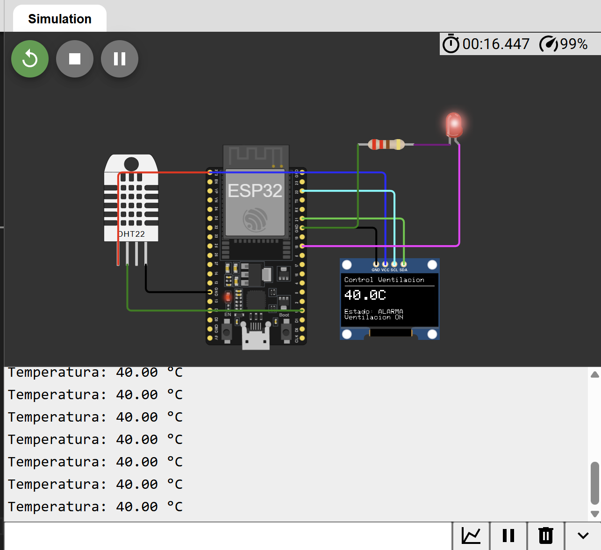

# Control Automático de Ventilación

## Descripción

Proyecto de automatización desarrollado con ESP32, sensor DHT22, pantalla OLED SSD1306 y un actuador simulado mediante un LED.

El sistema supervisa continuamente la temperatura ambiente y activa automáticamente un sistema de ventilación cuando la temperatura supera un umbral predefinido. La información se visualiza en tiempo real en una pantalla OLED, simulando aplicaciones utilizadas en centros de datos, tableros eléctricos, salas de servidores y sistemas HVAC.

---

## Objetivo

Implementar un sistema de control automático capaz de supervisar la temperatura ambiente y activar un sistema de ventilación cuando se detecten condiciones de sobrecalentamiento.

---

## Componentes Utilizados

* ESP32 DevKit V1
* Sensor DHT22
* Pantalla OLED SSD1306 (128x64 I2C)
* LED (Simulación de ventilador)
* Resistencia 220 Ω
* Wokwi Simulator

---

## Funcionamiento

El ESP32 realiza lecturas periódicas del sensor DHT22.

Cuando la temperatura supera el valor configurado:

* Se activa el ventilador (simulado con un LED).
* Se muestra el estado de alarma en la pantalla OLED.
* Se registra la información en el monitor serial.

Cuando la temperatura es inferior al umbral:

* El ventilador permanece apagado.
* El sistema opera en estado normal.

---

## Lógica de Control

```text
Temperatura ≤ 30°C
        ↓
Estado Normal
Ventilador OFF

Temperatura > 30°C
        ↓
Estado Alarma
Ventilador ON
```

---

## Arquitectura

```text
┌─────────────┐
│   DHT22     │
│ Temperatura │
└──────┬──────┘
       │
       ▼
┌─────────────┐
│    ESP32    │
│ Controlador │
└───┬─────┬───┘
    │     │
    │     │
    ▼     ▼
 OLED    LED
(HMI)  Ventilador
```

---

## Conexiones

### Sensor DHT22

| DHT22 | ESP32  |
| ----- | ------ |
| VCC   | 3V3    |
| DATA  | GPIO15 |
| GND   | GND    |

### Pantalla OLED SSD1306

| OLED | ESP32  |
| ---- | ------ |
| VCC  | 3V3    |
| GND  | GND    |
| SDA  | GPIO21 |
| SCL  | GPIO22 |

### Ventilador (LED)

| LED        | ESP32                  |
| ---------- | ---------------------- |
| Ánodo (+)  | GPIO18                 |
| Cátodo (-) | Resistencia 220Ω → GND |

---

## Diagrama



---

## Simulación en Wokwi

🔗 Simulación:

```text
https://wokwi.com/projects/467208611667647489
```

---

## Código

El código fuente se encuentra en:

```text
codigo/sketch.ino
```

---

## Interfaz OLED

### Estado Normal

```text
Control Ventilacion

Temp: 25.0 C

Estado: NORMAL
Ventilador OFF
```

### Estado de Alarma

```text
Control Ventilacion

Temp: 38.9 C

Estado: ALARMA
Ventilador ON
```

---

## Monitor Serial

Ejemplo de salida:

```text
Temperatura: 25.0 °C
Temperatura: 27.5 °C
Temperatura: 38.9 °C
```

---

## Características

* Monitoreo continuo de temperatura.
* Activación automática de ventilación.
* Control ON/OFF.
* Visualización mediante OLED SSD1306.
* Comunicación I2C.
* Indicador visual de estado.
* Registro de datos por monitor serial.
* Sistema de supervisión en tiempo real.

---

## Conceptos Aplicados

* Automatización Industrial
* Control ON/OFF
* Sistemas Embebidos
* Instrumentación Electrónica
* Sensores Digitales
* Actuadores
* Comunicación I2C
* Supervisión de Procesos

---

## Tecnologías Utilizadas

* ESP32
* Arduino Framework
* C/C++
* DHT22
* OLED SSD1306
* I2C
* Wokwi
* Git
* GitHub

---

## Aplicaciones Industriales

* Centros de datos.
* Salas de servidores.
* Sistemas HVAC.
* Tableros eléctricos.
* Cuartos de telecomunicaciones.
* Salas de control.
* Monitoreo de infraestructura crítica.
* Automatización industrial.

---

## Beneficios del Sistema

* Prevención de sobrecalentamiento.
* Automatización de procesos.
* Monitoreo en tiempo real.
* Reducción de intervención manual.
* Fácil escalabilidad.
* Bajo costo de implementación.

---

## Estructura del Proyecto

```text
02-control-automatico-ventilacion/
│
├── codigo/
│   └── sketch.ino
│
├── screenshot-circuito.png
│
├── docs/
│   └── README.md
```

---

## Mejoras Futuras

* Control proporcional de velocidad del ventilador mediante PWM.
* Múltiples sensores de temperatura.
* Historial de mediciones.
* Integración con dashboard web.
* Notificaciones de alarma.
* Integración con MQTT.
* Monitoreo remoto mediante IoT.
* Almacenamiento en base de datos.

---
